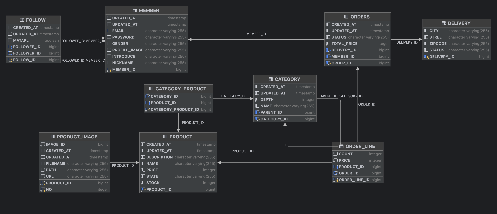

# spring-order-system

## 이커머스 주문 시스템

## 기술 스택

- Java17
- JPA
- H2
- Redis

## ERD 

## 상품 주문시 재고 동시성 문제

### 비관적 락(PlaceOrderServiceV1)

- 충돌이 자주 발생할 것이라고 가정하여 차례대로 ReentrantLock을 획득한 스레드만 실행
- 잠금으로 인해 다른 스레드는 대기해야 하므로, 동시성이 낮아지고 성능이 저하

### 낙관적 락(PlaceOrderServiceV2)

- 데이터 충돌이 드물 것이라고 가정하여 Lock을 사용하지 않고 JPA @Version 필드를 추가
- 여러 스레드 요청 중 충돌이 발생하면 롤백되기 때문에 하나의 요청을 제외한 나머지 요청은 실패 처리

### 분산 락(PlaceOrderServiceV3)

- Redisson 기능을 사용하여 분산 서버 환경에서도 동시성 문제 해결
- Redis에서 발행된 상품의 락을 모두 얻은 상태에서만 주문 로직 실행 
